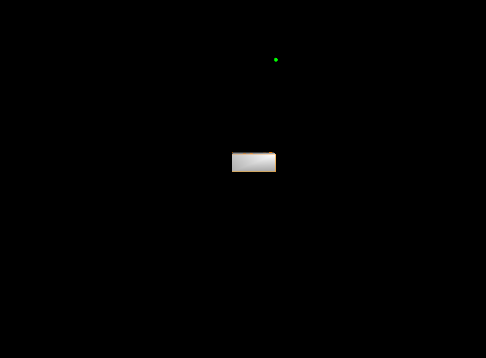

# SofaGym

Software toolkit to easily create an [Gym](https://github.com/openai/gym) environment out of any [SOFA](https://github.com/sofa-framework/sofa) scene.

The toolkit provides an API based on the standard Gym API, allowing to train classical Reinforcement Learning algorithms. 

The toolkit also comprises example scenes based on the SoftRobots plugin for SOFA to illustrate how to include SOFA simulations and train learning algorithms on them.

## Installation
### Prerequisites

#### 1) SofaGym need a [Sofa installation](https://www.sofa-framework.org/community/doc/getting-started/build/linux/) v22.12
with a mandatory plugin :
* [SofaPython3](https://github.com/sofa-framework/SofaPython3) (fetchable within sofa)

and optional plugins (mandatory to run the example environments integrated with sofagym): 
* [BeamAdapter](https://github.com/sofa-framework/BeamAdapter) (fetchable within sofa)
* [SPLIB](https://github.com/SofaDefrost/SPLIB)
* [STLIB](https://github.com/SofaDefrost/STLIB)
* [SoftRobots](https://github.com/SofaDefrost/SoftRobots)
* [ModelOrderReduction](https://github.com/SofaDefrost/ModelOrderReduction)
* [Cosserat](https://github.com/SofaDefrost/plugin.Cosserat)

[Plugins installation](https://www.sofa-framework.org/community/doc/plugins/build-a-plugin-from-sources/#in-tree-build) with a in-tree build is preferred.


#### 2) SofaGym python requierements :
We use python3.
mandatory : 
```bash
pip install gym==0.21 psutil pygame glfw pyopengl imageio
```
* [stable_baseline](https://github.com/DLR-RM/stable-baselines3)

optional :
* [Actor with Variance Estimated Critic (AVEC)](https://github.com/yfletberliac/actor-with-variance-estimated-critic)


### Install Sofagym 
```bash
python setup.py bdist_wheel
pip install -v -e .
```


## Quick start

```bash
export SOFA_ROOT=/sofa/build_dir/
export PYTHONPATH=/sofa/build_dir/lib/python3/site-packages:$PYTHONPATH
```
```python
import sofagym
```

The Gym framework allows to interact with an environment using well-known keywords:
- *step(a)*: allows to perform a simulation step when the agent performs the action *a*. Given the current state of the system *obs_t* and the action *a*, the environment then changes to a new state *obs_{t+1}* and the agent receives the reward *rew*. If the goal is reached, the *done* flag changes to *True*.
- *reset*: resets the environment.
- *render*: gives a visual representation of *obs_t*.

The use of this interface allows intuitive interaction with any environment, and this is what SofaGym allows when the environment is a Sofa scene. For more information on Gym, check the official [documentation page](https://www.gymlibrary.dev/).

Example of use :

```python
import gym
import sofagym.envs

env = gym.make('trunk-v0')
observation, info = env.reset(seed=42)

done = False
while not done:
    action = env.action_space.sample()  # this is where you would insert your policy
    observation, reward, done, info = env.step(action)
    env.render()

    done = terminated or truncated
   
env.close()
```

The classic running of an episode is therefore:
- *env = gym.make(env_name)*: creation of the environment using the gym interface.
- *env.reset()*: Initialization of the environment at its starting point.
- *action = model(obs_t)* and *env.step(action)*: execution of actions in the environment.
- *env.close()*: end of simulation and destruction of the environment.


## The environments

|Image|Name|Description|Status|
|----------|:-------------|:-------------|:-------------|
||[BubbleMotion](sofagym/envs/BubbleMotion/) bubblemotion-v0| |OK|
||[CartStem](sofagym/envs/CartStem/) cartstem-v0| |OK|
||[CartStemContact](sofagym/envs/CartStemContact/) cartstemcontact-v0| |OK|
| |[CatchTheObject](sofagym/envs/CatchTheObject/) catchtheobject-v0| |OK|
||[ConcentricTubeRobot](sofagym/envs/CTR/) concentrictuberobot-v0| |OK |
||[DiamondRobot](sofagym/envs/Diamond/) diamondrobot-v0| |OK|
||[Gripper](sofagym/envs/Gripper/) gripper-v0| The objective is to grasp a cube and bring it to a certain height.  The closer the cube is to the target, the greater the reward.| OK|
| |[Maze](sofagym/envs/Maze/) maze-v0| The Maze environment offers one scene  of a ball navigating in a maze. The maze is attached to the tripod robot and the ball is moved by gravity by modifying the maze’s orientation. The tripod is actuated by three servomotors. Similarly to the Trunk Environment, the Maze environment has a dicrete action space of 6 actions, moving  each  servomotor  by  one  increment,  and could easily be extended to be continuous.|AttributeError: Unable to find attribute: addNewData|
|  |[MultiGait Robot](sofagym/envs/MultiGaitRobot/) multigaitrobot-v0| The multigait Softrobot has  one  scene. The goal is to move the robot forward in the *x* direction with the highest speed. env = gym.make("multigaitrobot-v0")|[ERROR]   [SofaRuntime] ValueError: Object type MechanicalMatrixMapperMOR<Vec1d,Vec1d> was not created The object is not in the factory. Need MOR plugin ?|
| |[SimpleMaze](sofagym/envs/SimpleMaze/) simple_maze-v0| |ValueError: Object type Sphere<> was not created  | 
||[StemPendulum](sofagym/envs/StemPendulum/) stempendulum-v0| |OK |
||[Trunk](sofagym/envs/Trunk/) trunk-v0| The Trunk environment offers two scenarios.  Both are based on the trunk robot.  The first is to bring the trunk’s tip to a certain position. The second scenario is to manipulate a cup using the trunk to get the cup’s center of gravity in a predefined position. The  Trunk  is  controlled  by  eight  cables  that can be contracted or extended by one unit.  There are therefore 16 possible actions. The action space presented here is discrete but could easily be ex-tended to become continuous.|OK |
||[TrunkCup](sofagym/envs/TrunkCup/) trunkcup-v0| |OK|


### Adding new environment

It is possible to define new environments using SofaGym. For this purpose different elements have to be created:
- *NameEnv*: inherits from *AbstractEnv*. It allows to give the specificity of the environment like the action domain (discrete or continuous) and the configuration elements.
- *NameScene*: allows to create the Sofa scene. It must have the classic createScene function and return a *root*. To improve performance it is possible to separate the visual and computational aspects of the scene using the *mode* parameter (*'visu'* or *'simu'*). It allows you to choose the elements in the viewer-related scene or in the client-related scene. We also integrate two Sofa.Core.Controller (rewardShaper and goalSetter) that allow to integrate goal and reward in the scene.
- *NameToolbox*: allows to customize the environment. It defines the functions to retrieve the reward and the state of the environment as well as the command to apply to the system (link between the Gym action and the Sofa command). Note that we can define the Sofa.Core.Controller here. 

These different elements make it possible to create and personalise the task to be performed. See examples of environments for implementation.


## The tools

### Server/worker architecture

The major difficulty encountered in this work is the fact that it is not possible to copy the *root* from a Sofa simulation. This implies that when two sequences of actions *A_1 = [a_1, ..., a_n, new_action_1]* and *A_2 = [a_1, ..., a_n, new_action_2]* have to be tried, it is necessary to start again from the beginning each time and simulate again *[a_1, ..., a_n]*. This leads to a huge loss of performance. To solve this problem a server/worker architecture is set up.

A server takes care of distributing the calculations between several clients. Each client *i* is associated with an action sequence *A_i = [a_{i1}, ...., a_{in}]*. Given an action sequence *A = [a_{1}, ...., a_{n}]* and a new action *a*, the server looks for the client with the action sequence *A_i*. This client forks and the child executes the new action *a*. The father and son are referenced to the server as two separate clients and the action sequence *[a_{1}, ...., a_{n}]* and *[a_{1}, ...., a_{n}, a]* can be accessed.

A cleaning system is used to close clients that are no longer used. This makes it possible to avoid having an exponential number of open clients.

When it is not necessary to have access to the different states of the environment, i.e. when the actions are used sequentially, only one client is open and performs the calculations sequentially.

### Vectorized environment


Simulation training can be time consuming. It is therefore necessary to be able to parallelise the calculations. Since the actions are chosen sequentially, it is not possible to parallelise the calculations for one environment. The result depends on the previous result. However, it is possible to parallelise on several environments, meaning to run several simulations in parallel. This is done with the baseline of OpenAI: SubprocVecEnv.


### Separation between visualisation and computations

SofaGym separates calculations and visualisation. In order to achieve this, two scenes must be created: a scene *A* with all visual elements and a scene *B* with calculation elements (solvers, ...). Scene *A* is used in a viewer and scene *B* in the clients. Once the calculations have been performed in scene *B*, the positions of the points are given to the viewer which updates scene *A*.

## Results

In this section we demonstrate some use cases of the environments available in SofaGym, namely Reinforcement Learning, Imitation Learning, planning using Monte Carlo Tree Search and shape optimisation using Bayesian Optimization.

### Reinforcement Learning: Learning to grasp different objects with GripperEnv
### Imitation Learning: Learning to imitate an inverse controller with TrunkEnv
### Monte Carlo Tree Search: solving MazeEnv with planning


## Citing

If you use the project in your work, please consider citing it with:
```bibtex
@misc{SofaGym,
  authors = {Ménager, Etienne and Schegg, Pierre and Duriez, Christian and Marchal, Damien},
  title = {SofaGym: An OpenAI Gym API for SOFASimulations},
  year = {2020},
  publisher = {GitHub},
  journal = {GitHub repository},
}
```


## Notes

1. At the moment the available action spaces are: continuous, discrete, tuple and dictionary.
