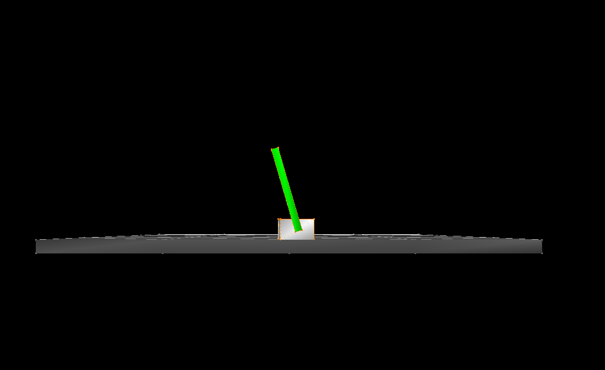
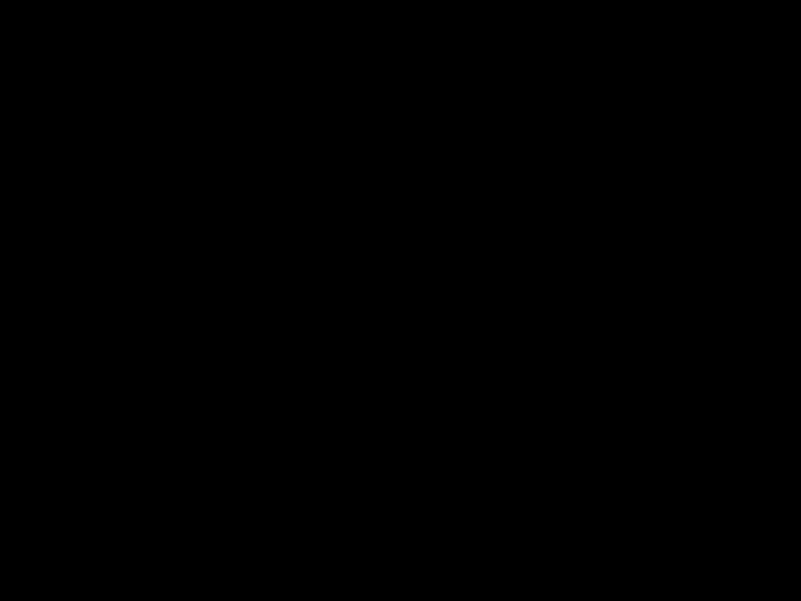

# CartPole in SofaGym Tutorial

This tutorial describes how to use the [SofaGym](https://github.com/SofaDefrost/SofaGym/) plugin to create a [Gym](https://github.com/Farama-Foundation/Gymnasium) environment for a custom SOFA scene and train it using Reinforcement Learning (RL).

The two main parts of this tutorial focus on creating the gym environment for the SOFA scene we want to train, and modifying the scene to add the necessary components to run the RL algorithms during the SOFA simulation.

Once completed, the knowledge acquired from this tutorial can be applied to other SOFA scenes.

Tutorial prerequisites:

- You have installed [Sofa](https://www.sofa-framework.org/) and the [SofaGym](https://github.com/SofaDefrost/SofaGym/) plugin with all the necessary dependencies.

- You have basic knowledge of the [Python](https://www.python.org/) programming language. If this is not the case you can go to [Python Tutorials](https://docs.python.org/3/tutorial/index.html).

- You have basic knowledge of scene modeling with SOFA. If not, please complete the [FirstSteps](https://github.com/SofaDefrost/SoftRobots/tree/master/examples/tutorials/FirstSteps) tutorial first.

This tutorial is applied to the [CartPole](https://github.com/SofaDefrost/SofaGym/tree/main/sofagym/envs/CartPole) example, shown in Figure 1. This environment is the same as the [one](https://gymnasium.farama.org/environments/classic_control/cart_pole/) found in the Gymnasium examples, which is based on the classical control problem of the cart-pole. The cart can move left and right, and the un-actuated pole is attached to it. The goal is to keep the pole balanced upright by only controlling the direction of the cart's motion.

<center>
<figure>
  
  <figcaption>Figure 1: CartPole environment simulation in SOFA.</figcaption>
</figure>
</center>


# Step 1: Create the CartPoleEnv Class

The first step is to create a custom gym environment for the SOFA scene we want to simulate and train. For in-depth documentation on this, you can check the gymnasium [tutorial](https://gymnasium.farama.org/tutorials/gymnasium_basics/environment_creation/#sphx-glr-tutorials-gymnasium-basics-environment-creation-py) for creating custom environments.

All gym environments are defined as classes that must inherit from the base `gym.Env` class and override the necessary methods. In SofaGym, our `AbstractEnv` class inherits from `gym.Env` to act as the base class for creating the SOFA gym environments. To create a new environment from a SOFA scene, you need to create a class for your environment that inherits from the `AbstractEnv` class. For this, we will create a new file `CartPoleEnv.py`.

```python
class CartPoleEnv(AbstractEnv):
    """Sub-class of AbstractEnv, dedicated to the cartpole scene.

    See the class AbstractEnv for arguments and methods.
    """
```

After creating the new environment class, the default configuration for the SOFA scene should be defined as a dictionary. The minimum required data that must be defined can be found in [`AbstractEnv` documentation](https://github.com/SofaDefrost/SofaGym/blob/main/sofagym/AbstractEnv.py#L45-L76). Other config data can be added if needed, according to the scene.

```python
#Setting a default configuration
    path = path = os.path.dirname(os.path.abspath(__file__))
    metadata = {'render.modes': ['human', 'rgb_array']}
    DEFAULT_CONFIG = {"scene": "CartPole",
                      "deterministic": True,
                      "source": [0, 0, 160],
                      "target": [0, 0, 0],
                      "goalList": [[0]],
                      "start_node": None,
                      "scale_factor": 10,
                      "dt": 0.001,
                      "timer_limit": 80,
                      "timeout": 50,
                      "display_size": (1600, 800),
                      "render": 0,
                      "save_data": False,
                      "save_image": False,
                      "save_path": path + "/Results" + "/CartPole",
                      "planning": False,
                      "discrete": False,
                      "start_from_history": None,
                      "python_version": "python3.9",
                      "zFar": 4000,
                      "time_before_start": 0,
                      "seed": None,
                      "init_x": 0,
                      "max_move": 24,
                      }
```

In the class `init`, we initialize any necessary variables and assign their values based on the previously defined config. For the CartPole env, we define the maximum value cart of the cart's motion on the x-axis as `x_threshold`. We also define the maximum allowed angle for the pole to tilt before it's considered to be falling.

We must also define the type of actions and observations the gym environment will use by defining the `action_space` and `observation_space`. In the CartPole case, we can only control the cart to move either left or right, so we have only two actions that we define as `Discrete(2)`. The observation space is defined as `Box()` which consists of 4 continuous values representing the cart x position, the cart velocity, the pole angle, and the pole angular velocity. The minimum and maximum values for the observations are also defined according to the allowed thresholds for the positions and velocities of the cart and pole. 

```python
    def __init__(self, config = None):
        super().__init__(config)

        self.x_threshold = 100
        self.theta_threshold_radians = self.config["max_move"] * math.pi / 180
        self.config.update({'max_angle': self.theta_threshold_radians})
        
        high = np.array(
            [
                self.x_threshold * 2,
                np.finfo(np.float32).max,
                self.theta_threshold_radians,
                np.finfo(np.float32).max,
            ],
            dtype=np.float32,
        )

        nb_actions = 2
        self.action_space = spaces.Discrete(nb_actions)
        self.nb_actions = str(nb_actions)

        self.observation_space = spaces.Box(high, -high, dtype=np.float32)
```

The second part is to override the `step` and `reset` methods from the `AbstractEnv` class. For the step method, no additions are required. For the reset method, we need to restart the scene using `start_scene` and return the first observation. It might also be needed to update some parameters or configs like the randomized goal position in the case of some environments.

```python
    def step(self, action):
        return super().step(action)

    def reset(self):
        """Reset simulation.

        Note:
        ----
            We launch a client to create the scene. The scene of the program is
            client_<scene>Env.py.

        """
        super().reset()

        self.config.update({'goalPos': self.goal})

        obs = start_scene(self.config, self.nb_actions)
        
        return np.array(obs['observation'])
```


# Step 2: Create the Environment's Toolbox

The next step is to implement the methods and functions necessary for the RL algorithms to work. Three essential parts need to be implemented for this, defining and applying the actions, defining and calculating the reward, and getting the new observation from the simulation and updating it. One additional component that is relevant to some environments is a `GoalSetter` to define and update a target goal if necessary.

First, we need to create a new file `CartPoleToolbox`. For each of the parts that need to be implemented, some components are required to be defined to make the SOFA scene compatible with SofaGym.
- Actions:
  - startCmd function
- Reward:
  - getReward function
  - RewardShaper class
- Observation:
  - getState function
  - getPos function
  - setPos function
- Goal:
  - GoalSetter class

## Actions
The possible actions that could be applied by the agent must be defined. The CartPole environment has two actions as discussed in the previous step, move the cart left or right. This could be achieved by applying a constant force field on the cart with a positive value (right direction) or a negative value (left direction) depending on the chosen action 0 or 1, respectively.

We can define an `ApplyAction` class that inherits from `Sofa.Core.Controller`, which allows us to add this component to the scene and make it update the value of the `constantForceField` component during the simulation steps. We initialize an `incr` variable to define the value of the force change between two consecutive steps.

The `compute_action` method sets the actual value of the action to take based on the value returned by the RL algorithm. The `_move` method is used to update the force field applied on the cart by changing the x value of the `constantForceField` object of the cart to control the motion of the cart left and right. Finally, the `apply_action` method will be used to apply the action by the agent.

```python
class ApplyAction(Sofa.Core.Controller):
    def __init__(self, *args, **kwargs):
        Sofa.Core.Controller.__init__(self, *args, **kwargs)

        self.root = kwargs["root"]
        self.cart = self.root.Modeling.Cart

        self.incr = 1000

    def _move(self, incr):
        cartForceField = self.cart.CartForce
        force = cartForceField.force.value.tolist()
        force[0] = incr
        cartForceField.force.value = np.array(force)

    def compute_action(self, actions):
        if actions == 0:
            incr = self.incr
        else:
            incr = -self.incr

        return incr

    def apply_action(self, incr):
        self._move(incr)
```

Next, the required part is to define the `startCmd` function, which is used by SofaGym as a link between Gym and SOFA to execute the actions as SOFA commands in the simulation. The `ApplyAction` class we defined is used here.

Two helper functions can be defined first. The `action_to_command` function returns the value of the action using `compute_action`. The `startCmd_CartPole` function is used to call the SOFA `AnimationManager` to execute the necessary command in the simulation based on the chosen action. By defining these two functions, it is simple to define the `startCmd` function to get the needed command and apply it to the simulation.

```python
def action_to_command(actions, root, nb_step):
    """Link between Gym action (int) and SOFA command (displacement of cables).

    Parameters:
    ----------
        action: int
            The number of the action (Gym).
        root:
            The root of the scene.

    Returns:
    -------
        The command.
    """

    incr = root.ApplyAction.compute_action(actions)
    return incr


def startCmd(root, actions, duration):
    """Initialize the command from root and action.

    Parameters:
    ----------
        rootNode: <Sofa.Core>
            The scene.
        action: int
            The action.
        duration: float
            Duration of the animation.

    Returns:
    ------
        None.

    """
    incr = action_to_command(actions, root, duration/root.dt.value + 1)
    startCmd_CartPole(root, incr, duration)


def startCmd_CartPole(rootNode, incr, duration):
    """Initialize the command.

    Parameters:
    ----------
        rootNode: <Sofa.Core>
            The scene.
        incr:
            The elements of the command.
        duration: float
            Duration of the animation.

    Returns:
    -------
        None.
    """

    # Definition of the elements of the animation
    def executeAnimation(rootNode, incr, factor):
        rootNode.ApplyAction.apply_action(incr)

    # Add animation in the scene
    rootNode.AnimationManager.addAnimation(
        Animation(
            onUpdate=executeAnimation,
            params={"rootNode": rootNode,
                    "incr": incr},
            duration=duration, mode="once"))
```

## Reward
For the reward, we define a `RewardShaper` class to inherit from `Sofa.Core.Controller` to update the reward value at each simulation step. In the initialization, we can define some parameters based on the scene configs, such as the pole length (`pole_length`) and the maximum angle (`max_angle`) the pole is allowed to tilt.

Depending on the scene, some helper methods could be defined to get or calculate different values. For the CartPole scene, we need to get the pole's x and y positions and the cart's x position. We also need to calculate the pole's angle and angular velocity. Finally, the `getReward` method uses these helper methods to calculate and return the reward, as well as, the necessary states to determine whether or not a termination condition happened. Since the reward is 1 for each step the pole stays within the max angle limit, we simply return 1 as the reward, in addition to the current pole angle and the max allowed angle.

An `update` method is also required to initialize the reward to specific values at each episode reset. In this case, it is not needed.

```python
class RewardShaper(Sofa.Core.Controller):
    """Compute the reward.

    Methods:
    -------
        __init__: Initialization of all arguments.
        getReward: Compute the reward.
        update: Initialize the value of cost.

    Arguments:
    ---------
        rootNode: <Sofa.Core>
            The scene.

    """
    def __init__(self, *args, **kwargs):
        """Initialization of all arguments.

        Parameters:
        ----------
            kwargs: Dictionary
                Initialization of the arguments.

        Returns:
        -------
            None.

        """
        Sofa.Core.Controller.__init__(self, *args, **kwargs)

        self.rootNode = None
        if kwargs["rootNode"]:
            self.rootNode = kwargs["rootNode"]
        if kwargs["max_angle"]:
            self.max_angle = kwargs["max_angle"]
        if kwargs["pole_length"]:
            self.pole_length = kwargs["pole_length"]
        
        else:
            print(">> ERROR: give a max angle for the normalization of the reward.")
            exit(1)

        self.cart = self.rootNode.Modeling.Cart
        self.pole = self.rootNode.Modeling.Pole

    def getReward(self):
        """Compute the reward.

        Parameters:
        ----------
            None.

        Returns:
        -------
            The reward and the cost.

        """
        #dist = abs(pole_x_pos - cart_pos)


        cart_pos = self._getCartPos()
        pole_theta, pole_theta_dot = self.calculatePoleTheta(cart_pos)
        
        return 1, pole_theta, self.max_angle

    def update(self):
        """Update function.

        This function is used as an initialization function.

        Parameters:
        ----------
            None.

        Arguments:
        ---------
            None.

        """
        pass

    def _getPolePos(self):
        pos = self.pole.MechanicalObject.position.value.tolist()[0]
        return pos[0], pos[1]

    def _getCartPos(self):
        pos = self.cart.MechanicalObject.position.value.tolist()[0][0]
        return pos
    
    def calculatePoleTheta(self, cart_pos):
        x_pos, y_pos = self._getPolePos()
        sin_theta = (y_pos/self.pole_length)
        theta = abs((90*math.pi/180) - math.asin(sin_theta))
        
        if x_pos < cart_pos:
            theta = -theta

        theta_dot = self.pole.MechanicalObject.velocity.value.tolist()[0][5]
        
        return theta, theta_dot
```
The `getReward` function must be defined to be used by SofaGym to calculate the reward value and done state and return them by Gym at each step. We simply use the `RewardShaper` class we just defined to get the reward and check if the episode is done based on the termination condition. For the CartPole, the episode ends when the pole angle `theta` exceeds the allowed limit (24 degrees as defined in the environment's config) in the left or right direction.

```python
def getReward(rootNode):
    reward, theta, max_angle = rootNode.Reward.getReward()
    done = (theta > max_angle) or (theta < -max_angle)

    return done, reward
```

## Observations
After applying the action to the simulation scene and calculating the returned reward, the new state of the environment must also be returned. To do this, it is required to define a `getState` function to get and calculate the new state and return it. As discussed in Step 1, the CartPole environment's state at each step consists of 4 values of the cart's x position and velocity, and the pole's angle and angular velocity. We can simply get the cart's state from the SOFA scene `cart` object, and we can use the method we previously defined in the Reward class to get the pole's state. 

```python
def getState(rootNode):
    """Compute the state of the environment/agent.

    Parameters:
    ----------
        rootNode: <Sofa.Core>
            The scene.

    Returns:
    -------
        State: list of float
            The state of the environment/agent.
    """
    cart = rootNode.Modeling.Cart
    pole = rootNode.Modeling.Pole

    cart_pos = cart.MechanicalObject.position.value.tolist()[0][0]
    cart_vel = cart.MechanicalObject.velocity.value.tolist()[0][0]

    pole_theta, pole_theta_dot = rootNode.Reward.calculatePoleTheta(cart_pos)

    state = [cart_pos, cart_vel, pole_theta, pole_theta_dot]

    return state
```

The second required part is to define two functions: `getPos` and `setPos` to retrieve the cart and pole positions at the beginning of each step and update them at the end of the step with the new state. These two functions are mainly needed for the rendering part.

```python
def getPos(root):
    cart_pos = root.Modeling.Cart.MechanicalObject.position.value[:].tolist()
    pole_pos = root.Modeling.Pole.MechanicalObject.position.value[:].tolist()
    return [cart_pos, pole_pos]


def setPos(root, pos):
    cart_pos, pole_pos = pos
    root.Modeling.Cart.MechanicalObject.position.value = np.array(cart_pos)
    root.Modeling.Pole.MechanicalObject.position.value = np.array(pole_pos)
```

## Goal
This step is only feasible for environments or scenes where a goal is defined, such as a target position that a robot needs to reach. The `GoalSetter` class can then be used to initialize the goal in the scene and update it at each episode or randomly change it for example.

Since the CartPole scene doesn't require this, no modifications to the goal class are needed.

```python
class GoalSetter(Sofa.Core.Controller):
    def __init__(self, *args, **kwargs):
        Sofa.Core.Controller.__init__(self, *args, **kwargs)

    def update(self):
        pass

    def set_mo_pos(self, goal):
        pass
```


# Step 3: Modify the Scene

The next step is to modify the scene to include the components we defined in the toolbox in the previous step. We need to modify the `CartPoleScene` file.

In this step, we simply add objects of the three classes we defined to the root node of the scene with the required parameters: `ApplyAction`, `RewardShaper`, and `GoalSetter`.

```python
# SofaGym Env Components
root.addObject(RewardShaper(name="Reward", rootNode=root, max_angle=config['max_angle'], pole_length=pole_length))

root.addObject(GoalSetter(name="GoalSetter"))

root.addObject(ApplyAction(name="ApplyAction", root=root))
```

It is also important to make sure that the scene includes the component that will be modified by the Gym action. In this case, the `constantForceField` component on the cart.

```python
# Force
cart.addObject('ConstantForceField', name="CartForce", totalForce=[0, 0, 0, 0, 0, 0])
```

Finally, if a goal is defined, the goal should also be added to the scene as a `MechanicalObject`.


# Step 4: Register the New Environment in Gym

The final step is to register the new environment so that Gym can locate it and run it. To do this, we must modify the [`__init__.py` file](https://github.com/SofaDefrost/SofaGym/blob/main/sofagym/envs/__init__.py). The `id` is the name that will be used to run the environment in gym ```gym.make('cartpole-v0')```. The `entry point` is the environment class we created in step 1 `CartPoleEnv`.

```python
from sofagym.envs.CartPole.CartPoleEnv import *
register(
    id='cartpole-v0',
    entry_point='sofagym.envs:CartPoleEnv',
)
```

To use the new environment with the test and training scripts in SofaGym, the environment `id` must be added to the environments' dictionaries in the respective files.

In [`test_env.py`](https://github.com/SofaDefrost/SofaGym/blob/main/test_env.py):
```python
name = {
        1:'bubblemotion-v0',
        2:'cartstem-v0',
        3:'cartstemcontact-v0',
        4:'catchtheobject-v0',
        5:'concentrictuberobot-v0',
        6:'diamondrobot-v0',
        7:'gripper-v0',
        8:'maze-v0',
        9:'multigaitrobot-v0',
        10:'simple_maze-v0',
        11:'stempendulum-v0',
        12:'trunk-v0',
        13:'trunkcup-v0',
        14: 'cartpole-v0'       #new CartPole env
        }
```

In [`rl.py`](https://github.com/SofaDefrost/SofaGym/blob/main/rl.py):
```python
envs = {
        1: 'bubblemotion-v0',
        2: 'cartstem-v0',
        3: 'cartstemcontact-v0',
        4: 'catchtheobject-v0',
        5: 'concentrictuberobot-v0',
        6: 'diamondrobot-v0',
        7: 'gripper-v0',
        8: 'maze-v0',
        9: 'multigaitrobot-v0',
        10: 'simple_maze-v0',
        11: 'stempendulum-v0',
        12: 'trunk-v0',
        13: 'trunkcup-v0',
        14: 'cartpole-v0'       #new CartPole env
        }
```


# Step 5: Train and Evaluate an RL Agent for the New Environment

To train the RL agent, the [`rl.py`](https://github.com/SofaDefrost/SofaGym/blob/main/rl.py) script could be used. Some training parameters can be specified using command line arguments: `-a` for the RL algorithm, `-fr` to choose the framework either `Stable Baselines3` or `rlberry`, `-ep` to specify the number of training epochs, and `-ne` to specify the number of training environments. 

Training hyperparameters specific to the chosen algorithm and framework can be defined in the appropriate [hyperparameters YAML file](https://github.com/SofaDefrost/SofaGym/tree/main/agents/hyperparameters).

To train this agent, we will be using the tuned hyperparameters for the `CartPole-v1` environment from [Rl Baselines3 Zoo](https://github.com/DLR-RM/rl-baselines3-zoo/blob/660f2d354ef9d63cd7a478390780dffa0cadb80c/hyperparams/ppo.yml#L31-L43), and we will train the agent for `3` epochs, which is `300000` total timesteps of training.

```bash
python rl.py -e cartpole-v0 -a PPO -fr SB3 -ep 3 -ne 8
```

To evaluate our trained agent, we also use the `rl.py` script, but instead of training, we choose to test the agent by setting the training argument `-tr` to none and adding the testing flag argument `-te`. The number of evaluation episodes is set to `5` using the number of testing episodes argument `-tn`. We also need to specify the path of the saved model to be evaluated `-md`, which should be in the working directory with the following format "`Results/env_name/algo_name/model_name`".

```bash
python rl.py -e cartpole-v0 -a PPO -fr SB3 -tr none -te -tn 5 -md Results/cartpole-v0/PPO/model_name
```

The results of the evaluation could be recorded as a video such as the following one:

